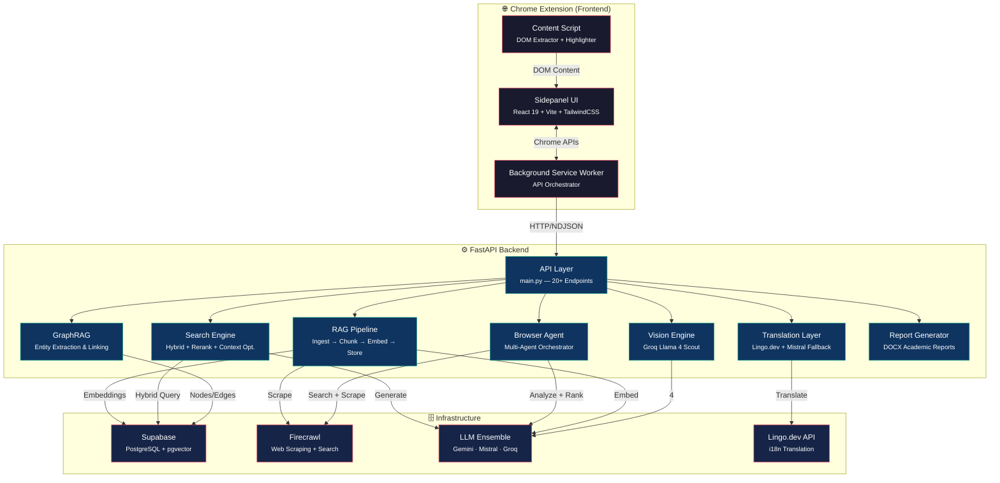
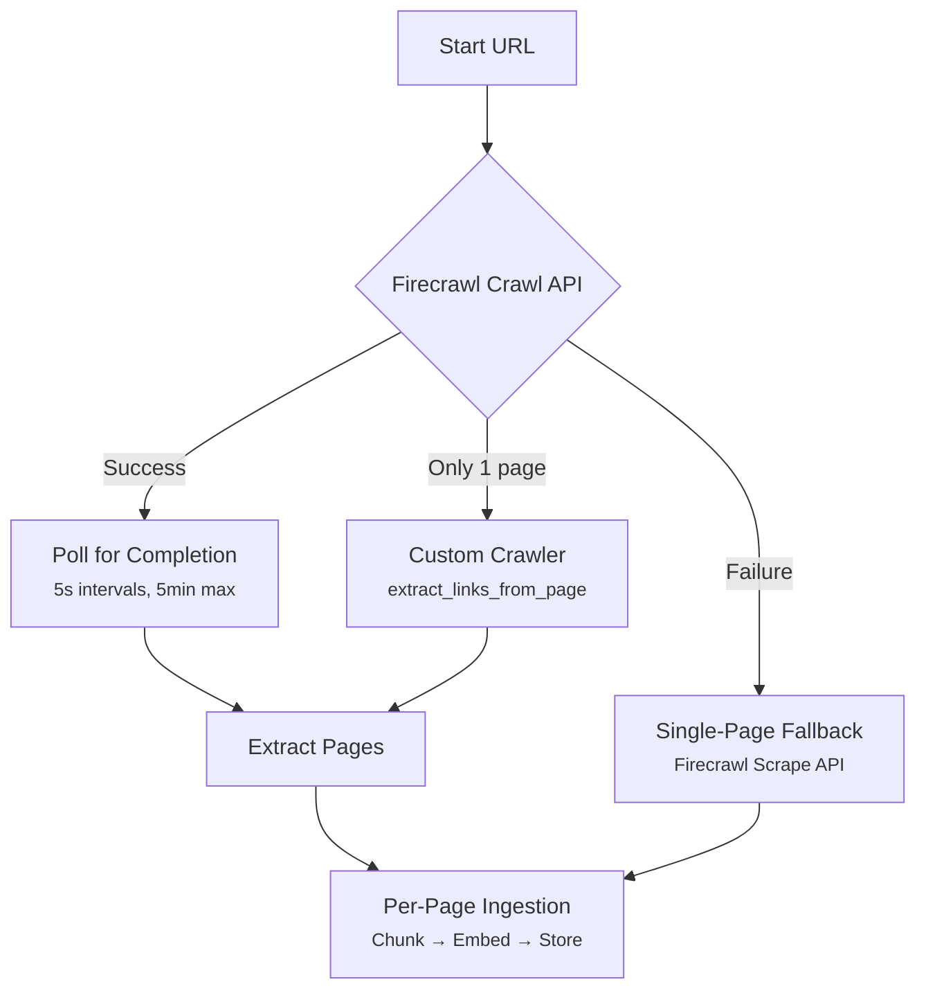
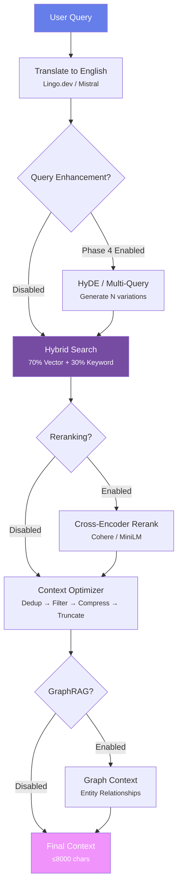
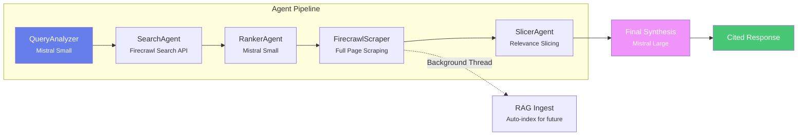
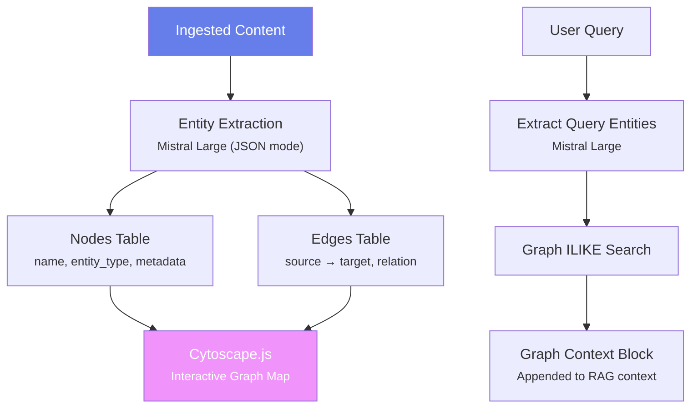
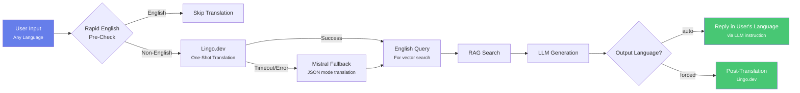
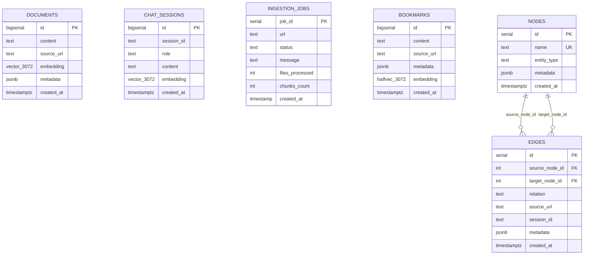

<p align="center">
  <h1 align="center">🧠 SnapMind</h1>
  <p align="center"><strong>The Autonomous Browser Research Agent & RAG Ecosystem</strong></p>
</p>

<p align="center">
  <a href="https://fastapi.tiangolo.com/"></a>
  <a href="https://reactjs.org/"></a>
  <a href="https://supabase.com/"></a>
  <a href="https://deepmind.google/technologies/gemini/"></a>
  <a href="https://mistral.ai/"></a>
  <a href="https://github.com/pgvector/pgvector"></a>
  <a href="https://groq.com/"></a>
  <a href="https://lingo.dev/"></a>
  <a href="https://www.firecrawl.dev/"></a>
</p>

---

**SnapMind** is a production-grade, autonomous RAG (Retrieval-Augmented Generation) ecosystem that transforms your browser into a context-aware research powerhouse. It's not just a chatbot — it **indexes**, **understands**, and **builds a semantic knowledge graph** of everything you research.

> **Demo Video**: [Watch on YouTube](https://youtu.be/nNg8kVpigPU) &nbsp;|&nbsp; **Deep Dive**: [Read on Medium](https://medium.com/p/da1ee44bc340?postPublishedType=initial) &nbsp;|&nbsp; **Community**: [Reddit](https://www.reddit.com/r/lingodotdev/comments/1rvhvz0/snapmind_an_ai_powered_rag_based_comprehensive/)

---

## 📑 Table of Contents

- [System Architecture](#-system-architecture)
- [Feature Catalog](#-feature-catalog)
  - [RAG Pipeline](#1-rag-pipeline-core)
  - [Ingestion Engine](#2-ingestion-engine)
  - [Search & Retrieval](#3-search--retrieval)
  - [Multi-Agent Browser Mode](#4-multi-agent-browser-mode)
  - [Knowledge Graph (GraphRAG)](#5-knowledge-graph-graphrag)
  - [Multimodal Vision](#6-multimodal-vision-analysis)
  - [Multi-Language Support](#7-multi-language-support)
  - [Research Notebook](#8-research-notebook--bookmarks)
  - [Research Report Generator](#9-research-report-generator)
  - [Chat & Streaming](#10-chat--streaming)
  - [Context Optimization](#11-context-optimization)
  - [Semantic Caching](#12-semantic-caching)
  - [Chrome Extension UI](#13-chrome-extension-ui)
- [Data Model & Database Schema](#-data-model--database-schema)
- [API Reference](#-api-reference)
- [Tech Stack](#-tech-stack)
- [Setup Instructions](#-setup-instructions)
- [Configuration Reference](#-configuration-reference)
- [Docker Deployment](#-docker-deployment)
- [Testing](#-testing)
- [Roadmap](#-roadmap)
- [License & Contributing](#-license--contributing)

---

## 🏗️ System Architecture

SnapMind is composed of three primary layers, optimized for low-latency retrieval and high-precision generation.



### Layer Breakdown

| Layer | Component | Technology | Role |
|:---|:---|:---|:---|
| **Frontend** | Sidepanel UI | React 19, Vite, TailwindCSS, Mermaid.js | Glassmorphism chat UI with real-time LLM streaming |
| **Frontend** | Background Service | Chrome Extension APIs | API orchestration, multi-step ingestion flows |
| **Frontend** | Content Script | DOM APIs | Live page extraction, text highlighting, selection capture |
| **Backend** | API Layer | FastAPI, Pydantic | 20+ REST endpoints with CORS & NDJSON streaming |
| **Backend** | RAG Pipeline | Python | Scrape → Translate → Chunk → Embed → Store |
| **Backend** | Search Engine | pgvector, PostgreSQL FTS | Hybrid Search + Cross-encoder Reranking + Context Optimization |
| **Backend** | Browser Agent | Multi-Agent LLM | Autonomous web research with Search → Rank → Scrape → Synthesize |
| **Backend** | GraphRAG | Mistral Large | Entity extraction and knowledge graph construction |
| **Backend** | Vision Engine | Groq (Llama 4 Scout) | Screenshot analysis, OCR, visual Q&A |
| **Backend** | Translation | Lingo.dev + Mistral | Bi-directional i18n with auto-detect and fallback |
| **Infra** | Database | Supabase (PostgreSQL + pgvector) | Vector embeddings, relational metadata, knowledge graph |
| **Infra** | Scraper | Firecrawl | Clean markdown extraction, multi-page crawl, web search |
| **Infra** | LLM Ensemble | Gemini 2.0, Mistral, Groq | Embeddings, generation, vision, reasoning |

---

## ✨ Feature Catalog

### 1. RAG Pipeline Core

The heart of SnapMind — a full ingestion-to-generation pipeline.


**Key capabilities:**
- **Semantic Chunking** — Respects markdown structure (headers, code blocks, tables). Splits by heading hierarchy with configurable overlap (default 20%)
- **Agentic Chunking** — Optional LLM-driven chunking using Mistral Large for high-quality semantic boundaries
- **Parallel Embedding** — ThreadPoolExecutor with shared client instances for zero-overhead embedding generation
- **Retry Logic** — Exponential backoff with decorators (`@db_retry`) for all database operations
- **URL Normalization** — Consistent source URL storage with query string preservation (important for YouTube `?v=` URLs)
- **Boilerplate Stripping** — Removes navigation, breadcrumbs, and link-dense sidebars from scraped content

---

### 2. Ingestion Engine

SnapMind supports diverse content sources through specialized parsers:

| Source Type | Parser | Technology | Features |
|:---|:---|:---|:---|
| **Web Pages** | `rag_pipeline.py` | Firecrawl API + BS4 fallback | Single-page or multi-page crawl (up to 50 pages, 3 levels deep) |
| **YouTube** | `youtube_parser.py` | `pytubefix` + `yt-dlp` + Invidious | Transcript extraction with automatic title detection |
| **Twitter/X** | `twitter_parser.py` | Custom parser | Thread extraction and content normalization |
| **PDF** | `rag_pipeline.py` | `PyPDF2` | Page-aware chunking with `SNAPMIND_PAGE_N` markers |
| **DOCX** | `rag_pipeline.py` | `python-docx` | Full document text extraction |
| **CSV** | `rag_pipeline.py` | `pandas` | Tabular data conversion |
| **GitHub Repos** | `repo_ingester.py` | `git clone` + file traversal | Background job with progress tracking |
| **Raw Text** | `rag_pipeline.py` | Direct ingestion | VLM/OCR output, clipboard content |

**Multi-Page Crawling Flow:**


**Background Ingestion (GitHub):**
- Uses FastAPI `BackgroundTasks` for non-blocking repo cloning
- Creates `ingestion_jobs` rows for real-time progress polling
- Tracks `files_processed` and `chunks_count`

---

### 3. Search & Retrieval

The search pipeline is a multi-stage system combining dense vectors, sparse keywords, cross-encoder reranking, and context optimization.



#### 3.1 Hybrid Search Algorithm

The custom PostgreSQL function `hybrid_search_documents` fuses semantic and keyword results:

```sql
-- Weighted Fusion (Reciprocal Rank Fusion variant)
((COALESCE(similarity, 0) × vector_weight) + (COALESCE(bm25_score, 0) × keyword_weight × 10)) AS combined_score
```

| Component | Weight | Purpose |
|:---|:---|:---|
| **Vector Search (70%)** | Cosine similarity via `pgvector` | Captures intent, synonyms, conceptual meaning |
| **Keyword Search (30%)** | PostgreSQL `ts_rank` + `plainto_tsquery` | Catches exact names, IDs, rare technical terms |

**Multi-Site Aggregation:** When multiple sites are pinned, results are queried per-site, deduplicated by ID, then merged by combined score.

**Global Fallback:** If no results match the pinned sites, an automatic global search is triggered.

#### 3.2 Cross-Encoder Reranking

```
Initial Retrieval (20 candidates) → Reranker → Top 5 Final Results
```

| Provider | Model | Notes |
|:---|:---|:---|
| **Cohere** (primary) | `rerank-english-v3.0` | API-based, state-of-the-art accuracy |
| **Local** (fallback) | `cross-encoder/ms-marco-MiniLM-L-6-v2` | CPU-based, no external API needed |
| **None** | — | Returns original order (fastest) |

The reranker uses an automatic fallback chain: Cohere → Local Cross-Encoder → original order.

#### 3.3 Context Optimization

Four-step pipeline before sending context to the LLM:

1. **Deduplication** — Jaccard similarity (`>90%` overlap = duplicate)
2. **Relevance Filtering** — Removes chunks below `MIN_RELEVANCE_SCORE`
3. **Compression** — Strips boilerplate (copyright notices, navigation text, excessive whitespace)
4. **Smart Truncation** — Priority-ordered truncation respecting `MAX_CONTEXT_LENGTH` (default: 8000 chars)

---

### 4. Multi-Agent Browser Mode

An autonomous web research agent that searches, evaluates, scrapes, and synthesizes answers from live web results.



**Agents:**

| Agent | Model | Role |
|:---|:---|:---|
| `QueryAnalyzer` | Mistral Small | Generates 1-2 refined, long-tail search queries |
| `SearchAgent` | Firecrawl Search API | Executes web search, returns top 5 results per query |
| `RankerAgent` | Mistral Small | LLM-based relevance ranking, selects top 3 URLs |
| `SlicerAgent` | Mistral Small | Extracts most relevant ~6000 char window from large pages |
| `FirecrawlScraper` | Firecrawl Scrape API | Full markdown extraction with 502/504 error handling |
| `BrowserOrchestrator` | — | Coordinates all agents, manages context budget (8000 chars) |

**Key behaviors:**
- **RAG-First Decision:** Checks local memory/notebook before web search. Skips web if local context > 4000 chars
- **Background Ingestion:** Every scraped page is auto-indexed into the vector DB via daemon threads
- **Multimodal Integration:** Accepts `image_data` (base64) — analyzes screenshots via Groq Vision before web search
- **Clean Citation System:** Every chunk gets a unique `br-block-{runId}-{N}` ID for inline citation
- **Markdown Cleaning:** Aggressive boilerplate removal (navigation, breadcrumbs, link-dense lines, image filenames)

---

### 5. Knowledge Graph (GraphRAG)

Automatically discovers entities and relationships from ingested content and makes them queryable.



**Features:**
- **Entity Types:** People, Organizations, Concepts, Objects
- **Relationship Types:** works_for, located_in, part_of, related_to, etc.
- **Session Scoping:** Graph edges are linked to `session_id` for per-conversation isolation
- **Deadlock Protection:** Thread-serialized writes via `GRAPH_LOCK` with `@db_retry` (up to 15 retries)
- **Visualization:** Real-time Cytoscape.js force-directed graph in the extension sidepanel
- **Contextual Augmentation:** Graph relationships are injected into search context when `GRAPHRAG_ENABLED=true`

---

### 6. Multimodal Vision Analysis

Analyze screenshots, diagrams, and data-heavy images directly from the browser.

| Capability | Mode | Model |
|:---|:---|:---|
| **Visual Q&A** | `qa` | Groq (Llama 4 Scout 17B) |
| **Text Extraction (OCR)** | `extraction` | Groq (Llama 4 Scout 17B) |

**Features:**
- MIME type auto-detection (JPEG, PNG, GIF, WebP)
- Base64 data URL encoding
- Post-processing translation via Lingo.dev (if `target_lang` specified)
- Integration with Browser Agent (screenshot context injected into web queries)
- Suggested follow-up questions from visual elements

---

### 7. Multi-Language Support

Full i18n pipeline powered by **Lingo.dev** with **Mistral** as fallback.



**Supported workflow:**
1. **Ingestion Translation:** Content is translated to the target language *before* chunking (for correct embeddings)
2. **Query Translation:** Non-English queries are auto-translated to English for vector search
3. **Response Translation:** Generated responses can be forced into any target language
4. **Cross-Lingual Comparison:** Pin two sites in different languages — automatic translation baselines are appended for comparison analysis

**Reliability features:**
- Rapid English pre-check (regex-based, avoids unnecessary API calls)
- Non-ASCII heuristic: Backend forces translation if `>20%` non-ASCII characters
- Unreliable detection guard: Catches when Lingo.dev misdetects English as Romance languages
- 90-second HTTP/1.1 timeout with Mistral JSON-mode fallback

---

### 8. Research Notebook & Bookmarks

A persistent "Research Notebook" for saving, searching, and correlating research snippets.

**Features:**
- **Semantic Bookmark Storage:** Each bookmark is embedded with a `halfvec(3072)` vector for semantic search
- **Hybrid Bookmark Search:** Vector search (cosine distance < 0.5) + keyword `ILIKE` fallback + general/latest fallback
- **Notebook Correlation Mode:** Toggle `query_notebook: true` to search bookmarks alongside the main RAG DB
- **Cross-Reference Analysis:** Deep reasoning about connections between bookmarks (causal, legal, prerequisite links)
- **CRUD API:** Create, Read, Delete bookmarks with full metadata support

---

### 9. Research Report Generator

Generate formal academic research papers as downloadable DOCX files.

**Paper Structure:**
1. Title Page
2. Abstract
3. Introduction
4. Literature Review & Current Landscape
5. Methodology
6. Core Analysis & Findings
7. Discussion & Implications
8. Conclusion
9. References (with source URLs)

**Flow:**
1. Fetches ALL indexed documents and bookmarks for the session (no character cap)
2. Synthesizes via Mistral Large in formal academic tone
3. Converts Markdown → DOCX using `python-docx` (headings, bullets, paragraphs)
4. Returns downloadable `.docx` file

---

### 10. Chat & Streaming

**Two chat modes:**

| Mode | Endpoint | Protocol | Use Case |
|:---|:---|:---|:---|
| **Synchronous** | `POST /chat` | JSON | Simple request-response |
| **Streaming** | `POST /chat/stream` | NDJSON | Real-time token-by-token rendering |

**Context Priority (in order):**
1. Research Notebook (if `query_notebook: true`)
2. Vector DB / Indexed RAG context
3. Live Page content (`content_blocks` from DOM)
4. Raw page text (`page_content`)

**Chat Intelligence:**
- **Generative UI:** Automatically generates Mermaid.js diagrams when users ask for workflows/architectures
- **Citation System:** Every fact is cited with block IDs (e.g., `[db-block-1]`, `[nb-block-3]`, `[br-block-1234-5]`)
- **Semantic Chat Memory:** Conversations are persisted to `chat_sessions` with vector embeddings for semantic recall
- **Follow-up Suggestions:** 2-3 contextual suggestions generated at the end of each response
- **Numeric Footnote Scrubbing:** Strips leaked `[1]`, `[23]` style citations from LLM output
- **Contextual Suggestions:** `POST /chat/suggest` generates 3 questions based on current page

---

### 11. Context Optimization

The `ContextOptimizer` class applies four techniques to minimize token usage:

| Step | Technique | Impact |
|:---|:---|:---|
| 1 | **Deduplication** | Removes chunks with >90% Jaccard word overlap |
| 2 | **Relevance Filtering** | Drops below `MIN_RELEVANCE_SCORE` threshold |
| 3 | **Compression** | Strips copyright notices, "click here" phrases, excessive whitespace |
| 4 | **Smart Truncation** | Priority-ordered selection respecting 8000 char budget |

Returns `OptimizedContext` with full metrics: `original_tokens`, `optimized_tokens`, `compression_ratio`, `removed_duplicates`.

---

### 12. Semantic Caching

In-memory (or Redis) cache for single-turn RAG queries.

- **Cache key:** Semantic similarity of query embedding (threshold: 0.95)
- **TTL:** 1 hour for general queries, 24 hours for indexed content queries
- **Scope:** Only caches single-turn, non-conversational RAG queries

---

### 13. Chrome Extension UI

| Feature | Description |
|:---|:---|
| **Glassmorphism Design** | Modern frosted-glass UI with smooth animations |
| **Pin Tab System** | Pin multiple tabs for multi-source comparison |
| **Descriptive Citation Bubbles** | Citations show handle names like `[SSOC 1]` or `[HW 3]` instead of numbers |
| **Text-Fragment Highlighting** | Click a citation → jumps to the exact text on the source page using `#:~:text=` fragments |
| **PDF Page Navigation** | Citations for PDFs navigate to the correct page via `#page=N` |
| **Graph Map** | Real-time Cytoscape.js visualization of knowledge graph |
| **Mermaid Rendering** | Inline diagram rendering for process/architecture queries |
| **Markdown Rendering** | Full GFM support with `react-markdown`, `rehype-highlight`, syntax highlighting |
| **Image Capture** | Screenshot capture for visual Q&A (sent as base64) |
| **Selection Actions** | Select text → Ingest/Bookmark/Ask actions |
| **Settings Panel** | Configure server URL, API keys, output language |
| **Toast Notifications** | `sonner` for non-intrusive status updates |

**Extension Architecture:**

```
extension/
├── src/
│   ├── sidepanel/           # React UI
│   │   ├── App.jsx          # Main application (~134K, all UI logic)
│   │   ├── components/      # Reusable UI components
│   │   └── styles/          # TailwindCSS styles
│   ├── background/
│   │   ├── index.js         # Service worker (Chrome APIs, tab management)
│   │   ├── api.js           # API client layer (~42K, all backend calls)
│   │   └── capture.js       # Screenshot capture
│   ├── content/
│   │   ├── index.js         # Content script entry
│   │   ├── extractor.js     # DOM content extraction
│   │   ├── highlighter.js   # Text fragment highlighting engine
│   │   └── selection.js     # Text selection handling
│   └── shared/
│       └── utils.js         # Shared utilities
├── vite.config.js           # Build configuration
└── package.json             # Dependencies
```

---

## 🗄️ Data Model & Database Schema

SnapMind uses **Supabase** (PostgreSQL + pgvector) with the following schema:



### Indexes

| Table | Index | Type | Purpose |
|:---|:---|:---|:---|
| `documents` | `idx_documents_content_fts` | GIN (Full-Text) | Keyword/BM25 search |
| `documents` | `idx_documents_source_url` | B-Tree | Site filtering |
| `documents` | `idx_documents_metadata` | GIN (JSONB) | Tag/metadata queries |
| `chat_sessions` | `idx_chat_sessions_embedding` | HNSW (`halfvec_cosine_ops`) | Semantic memory recall |
| `chat_sessions` | `idx_chat_sessions_session_id` | B-Tree | Session lookup |
| `edges` | `idx_edges_session_id` | B-Tree | Session-scoped graph queries |
| `nodes` | `idx_nodes_name` | B-Tree | Entity name lookup |

### Database Functions

**`hybrid_search_documents()`** — Custom PL/pgSQL function that performs:
1. Vector similarity search (cosine) against `embedding` column
2. Full-text keyword search via `ts_rank` + `plainto_tsquery`
3. `FULL OUTER JOIN` to merge results
4. Weighted fusion: `(vector_weight × similarity) + (keyword_weight × bm25 × 10)`

---

## 📡 API Reference

### Ingestion Endpoints

| Method | Endpoint | Description |
|:---|:---|:---|
| `POST` | `/ingest` | Ingest a URL (single/multi-page crawl) or raw text |
| `POST` | `/ingest/file` | Upload and ingest local files (PDF, DOCX, CSV, TXT) |
| `POST` | `/ingest/github` | Background ingest of a GitHub repository |
| `GET` | `/ingest/status/{job_id}` | Poll background ingestion job status |

### Chat Endpoints

| Method | Endpoint | Description |
|:---|:---|:---|
| `POST` | `/chat` | Synchronous chat with RAG context |
| `POST` | `/chat/stream` | Streaming chat (NDJSON protocol) |
| `POST` | `/chat/suggest` | Generate 3 contextual follow-up suggestions |

### Browser Agent Endpoints

| Method | Endpoint | Description |
|:---|:---|:---|
| `POST` | `/browser/query` | Multi-agent autonomous web research |
| `POST` | `/browser/generate_report` | Generate downloadable DOCX research report |
| `GET` | `/browser/ingest_status/{session_id}` | Check research ingestion progress |

### Translation

| Method | Endpoint | Description |
|:---|:---|:---|
| `POST` | `/translate` | Translate text via Lingo.dev with Mistral fallback |

### Image Analysis

| Method | Endpoint | Description |
|:---|:---|:---|
| `POST` | `/analyze-image` | Analyze image via Vision model (QA or OCR mode) |

### Knowledge Graph

| Method | Endpoint | Description |
|:---|:---|:---|
| `GET` | `/graph/data` | Full knowledge graph (all nodes + edges) |
| `GET` | `/graph/sessions` | List sessions with graph data |
| `GET` | `/graph/session/{session_id}` | Get session-scoped graph (Cytoscape format) |

### Site & Content Management

| Method | Endpoint | Description |
|:---|:---|:---|
| `GET` | `/sites` | List all indexed sites with metadata |
| `DELETE` | `/sites/{site_id}` | Delete all documents for a source URL |
| `GET` | `/export/{source_url}` | Export site content as JSON or plain text |
| `GET` | `/tags` | Get all unique semantic tags |

### Bookmarks

| Method | Endpoint | Description |
|:---|:---|:---|
| `POST` | `/bookmarks` | Create a bookmark with semantic embedding |
| `GET` | `/bookmarks` | List all bookmarks |
| `DELETE` | `/bookmarks/{id}` | Delete a bookmark |

### Health & Debug

| Method | Endpoint | Description |
|:---|:---|:---|
| `GET` | `/` | Minimal health check |
| `GET` | `/debug/health` | Detailed diagnostics (Python version, Mistral status, etc.) |
| `GET` | `/debug/urls` | List all indexed source URLs |

### Authentication

All API keys are passed via request headers (BYOK — Bring Your Own Key model):

| Header | Service |
|:---|:---|
| `x-gemini-key` | Google Gemini (embeddings, generation) |
| `x-mistral-key` | Mistral AI (generation, reranking, analysis) |
| `x-firecrawl-key` | Firecrawl (scraping, search) |
| `x-lingodev-key` | Lingo.dev (translation) |
| `x-groq-key` | Groq (vision models) |

---

## 🛠️ Tech Stack

### Backend

| Package | Version | Purpose |
|:---|:---|:---|
| `fastapi` | Latest | HTTP framework |
| `uvicorn` | Latest | ASGI server |
| `psycopg[binary,pool]` | Latest | PostgreSQL driver with connection pooling |
| `pgvector` | Latest | Vector similarity search |
| `google-genai` | Latest | Gemini embeddings & generation |
| `mistralai` | 1.1.0 | Mistral AI SDK |
| `cohere` | Latest | Cross-encoder reranking |
| `sentence-transformers` | Latest | Local cross-encoder fallback |
| `httpx[http2]` | Latest | HTTP client for Lingo.dev |
| `PyPDF2` | Latest | PDF parsing |
| `python-docx` | Latest | DOCX parsing & generation |
| `pandas` | Latest | CSV parsing |
| `pytubefix` | Latest | YouTube transcript extraction |
| `yt-dlp` | Latest | YouTube fallback |
| `youtube-transcript-api` | Latest | YouTube transcript API |
| `beautifulsoup4` | Latest | HTML scraping fallback |
| `requests` | Latest | HTTP client |
| `websockets` | ≥13.0 | WebSocket support |

### Extension (Frontend)

| Package | Version | Purpose |
|:---|:---|:---|
| `react` | 19.2 | UI framework |
| `react-dom` | 19.2 | DOM rendering |
| `vite` | 7.2 | Build tool |
| `tailwindcss` | 3.4 | Utility-first CSS |
| `cytoscape` | 3.30 | Knowledge graph visualization |
| `mermaid` | 11.12 | Diagram rendering |
| `react-markdown` | 10.1 | Markdown rendering |
| `rehype-highlight` | 7.0 | Syntax highlighting |
| `remark-gfm` | 4.0 | GitHub Flavored Markdown |
| `lucide-react` | 0.561 | Icon library |
| `sonner` | 2.0 | Toast notifications |
| `@radix-ui/react-hover-card` | 1.1 | Hover card UI |

---

## 🚀 Setup Instructions

### Prerequisites

- **Python** 3.10+
- **Node.js** 18+
- **Google Chrome** (for the extension)
- API keys for at least: Gemini, Mistral, Firecrawl

### 1. Backend Setup

```bash
# Clone the repository
git clone https://github.com/roshankumar0036singh/SnapMind.git
cd SnapMind/backend

# Create virtual environment
python -m venv .venv

# Activate (Windows)
.venv\Scripts\activate
# Activate (Linux/macOS)
source .venv/bin/activate

# Install dependencies
pip install -r requirements.txt

# Configure environment
cp .env.example .env
# Edit .env and add your API keys in the REQUIRED section
```

> **Note:** The Supabase database URL and anon key are pre-configured in `.env.example` for testing.

```bash
# Run the database setup (first time only)
# Execute supabase_setup.sql in your Supabase SQL editor

# Start the backend
uvicorn main:app --reload
```

The backend will be available at `http://localhost:8000`.

### 2. Extension Setup

```bash
cd ../extension

# Install dependencies
npm install

# Build the extension
npm run build
```

**Load into Chrome:**
1. Navigate to `chrome://extensions/`
2. Enable **Developer mode** (top right)
3. Click **Load unpacked** → select `extension/dist`
4. Open the SnapMind sidepanel
5. Go to **Settings** → set **Server URL** to `http://localhost:8000`
6. Enter your API keys in the Settings panel

---

## ⚙️ Configuration Reference

All configuration is managed through environment variables in `backend/.env`:

### Core API Keys

| Variable | Required | Service |
|:---|:---|:---|
| `DATABASE_URL` | ✅ | PostgreSQL connection string |
| `GOOGLE_API_KEY` | ✅ | Gemini embeddings & generation |
| `MISTRAL_API_KEY` | ✅ | Mistral AI (generation, analysis) |
| `FIRECRAWL_API_KEY` | ✅ | Web scraping & search |
| `GROQ_API_KEY` | ⬜ | Multimodal vision (Llama 4) |
| `LINGODEV_API_KEY` | ⬜ | Lingo.dev translation |
| `COHERE_API_KEY` | ⬜ | Cohere cross-encoder reranking |

### Chunking Configuration

| Variable | Default | Description |
|:---|:---|:---|
| `SEMANTIC_CHUNKING_ENABLED` | `true` | Enable structure-aware chunking |
| `MIN_CHUNK_SIZE` | `200` | Minimum chunk size (chars) |
| `TARGET_CHUNK_SIZE` | `800` | Target chunk size (chars) |
| `MAX_CHUNK_SIZE` | `1200` | Maximum chunk size (chars) |
| `CHUNK_OVERLAP_PERCENTAGE` | `0.2` | Overlap between adjacent chunks |
| `PRESERVE_CODE_BLOCKS` | `true` | Keep code blocks intact |
| `PRESERVE_TABLES` | `true` | Keep tables intact |

### Search Configuration

| Variable | Default | Description |
|:---|:---|:---|
| `SEARCH_MODE` | `hybrid` | `vector_only`, `hybrid`, or `keyword_only` |
| `MATCH_THRESHOLD` | `0.3` | Minimum similarity score |
| `MATCH_COUNT` | `10` | Number of results to retrieve |
| `VECTOR_WEIGHT` | `0.7` | Weight for vector similarity |
| `KEYWORD_WEIGHT` | `0.3` | Weight for keyword matching |

### Embedding Configuration

| Variable | Default | Description |
|:---|:---|:---|
| `EMBEDDING_MODEL` | `gemini-embedding-001` | Model for vector embeddings |
| `MAX_EMBEDDING_WORKERS` | `3` | Parallel embedding threads |
| `EMBEDDING_BATCH_SIZE` | `10` | Batch size for bulk operations |

### Reranking Configuration

| Variable | Default | Description |
|:---|:---|:---|
| `RERANK_ENABLED` | `true` | Enable cross-encoder reranking |
| `RERANK_MODEL` | `cohere` | `cohere`, `local`, or `none` |
| `RERANK_CANDIDATES` | `20` | Candidates to rerank |
| `RERANK_TOP_K` | `5` | Final results after reranking |

### Caching Configuration

| Variable | Default | Description |
|:---|:---|:---|
| `CACHE_ENABLED` | `true` | Enable semantic caching |
| `CACHE_BACKEND` | `memory` | `memory` or `redis` |
| `CACHE_TTL_GENERAL` | `3600` | Cache TTL for general queries (seconds) |
| `CACHE_TTL_INDEXED` | `86400` | Cache TTL for indexed queries (seconds) |
| `CACHE_SIMILARITY_THRESHOLD` | `0.95` | Similarity for cache hit |

### Generation Configuration

| Variable | Default | Description |
|:---|:---|:---|
| `GENERATION_MODEL` | `mistral-small-latest` | Primary LLM for generation |
| `TEMPERATURE` | `0.7` | Generation temperature |
| `MAX_TOKENS` | `2000` | Max tokens per response |
| `STREAMING_ENABLED` | `true` | Enable NDJSON streaming |

### Feature Flags

| Variable | Default | Description |
|:---|:---|:---|
| `PHASE_1_ENABLED` | `true` | Semantic Chunking |
| `PHASE_2_ENABLED` | `true` | Hybrid Search |
| `PHASE_3_ENABLED` | `true` | Cross-Encoder Reranking |
| `PHASE_4_ENABLED` | `false` | Query Enhancement (HyDE) |
| `PHASE_5_ENABLED` | `true` | Context Optimization |
| `PHASE_6_ENABLED` | `true` | Semantic Caching |
| `GRAPHRAG_ENABLED` | `true` | Knowledge Graph |
| `AGENTIC_CHUNKING_ENABLED` | `true` | LLM-driven Chunking |

---

## 🐳 Docker Deployment

```bash
cd backend

# Build the Docker image
docker build -t snapmind-backend .

# Run with environment variables
docker run -p 7860:7860 --env-file .env snapmind-backend
```

Or use Docker Compose:

```bash
docker-compose up --build
```

The Dockerfile uses `python:3.10-slim`, installs system dependencies (`gcc`, `libpq-dev`, `git`), and exposes port `7860` (Hugging Face Spaces default).

---

## 🧪 Testing

The project includes comprehensive test files:

| Test File | Coverage |
|:---|:---|
| `test_chunking.py` | Semantic chunking logic |
| `test_hybrid_search.py` | Hybrid search algorithm |
| `test_reranker.py` | Cross-encoder reranking |
| `test_context_optimization.py` | Context optimizer pipeline |
| `test_query_enhancement.py` | Query enhancement (HyDE) |
| `test_cache.py` | Semantic caching |
| `test_translation_workflow.py` | Full translation pipeline |
| `test_youtube_robustness.py` | YouTube parser resilience |
| `test_notebook_correlation.py` | Research notebook search |
| `test_vision_rag_ingest.py` | Vision + RAG integration |
| `test_models.py` | Model initialization |
| `test_repo_ingest.py` | GitHub repository ingestion |

Run tests:
```bash
cd backend
python -m pytest test_*.py -v
```

---

## 🗺️ Roadmap

- [x] ✅ **Semantic Chunking** — Structure-aware text splitting
- [x] ✅ **Hybrid Search** — Vector + Keyword fusion (RRF)
- [x] ✅ **Cross-Encoder Reranking** — Cohere + local fallback
- [x] ✅ **Context Optimization** — Dedup, compress, truncate
- [x] ✅ **Semantic Caching** — In-memory cache with similarity matching
- [x] ✅ **Multi-Language Support** — Lingo.dev + Mistral translation
- [x] ✅ **Streaming Chat** — NDJSON real-time responses
- [x] ✅ **Relational GraphRAG** — Entity linking across sources
- [x] ✅ **Multi-Site Comparison** — Pin-tab with descriptive citations
- [x] ✅ **Research Notebook** — Semantic bookmark search & correlation
- [x] ✅ **Multimodal Vision** — Screenshot Q&A and OCR
- [x] ✅ **Multi-Agent Browser** — Autonomous web research
- [x] ✅ **Report Generator** — DOCX academic paper synthesis
- [x] ✅ **GitHub Repo Ingestion** — Background indexing of repositories
- [x] ✅ **File Upload** — PDF, DOCX, CSV, TXT ingestion
- [x] ✅ **Cross-Lingual Comparison** — Automatic translation baselines for multi-language sites
- [ ] 🔲 **Autonomous Web Agents** — Letting the AI browse the web in real-time
- [ ] 🔲 **Collaborative Research** — Real-time shared notebooks for teams
- [ ] 🔲 **Custom Embedding Models** — Fine-tuned domain-specific embeddings
- [ ] 🔲 **Advanced Monitoring** — Retrieval quality metrics and latency dashboards

---

## 📄 License & Contributing

Built for research efficiency. Contributions are welcome — please see `CONTRIBUTING.md` for coding standards.

---

<p align="center">
  <sub>Built with ❤️ by the SnapMind team</sub>
</p>

### Architecture
Detailed documentation coming soon.

### Security
Detailed documentation coming soon.

### Deployment
Detailed documentation coming soon.

### AI Agents
Detailed documentation coming soon.
