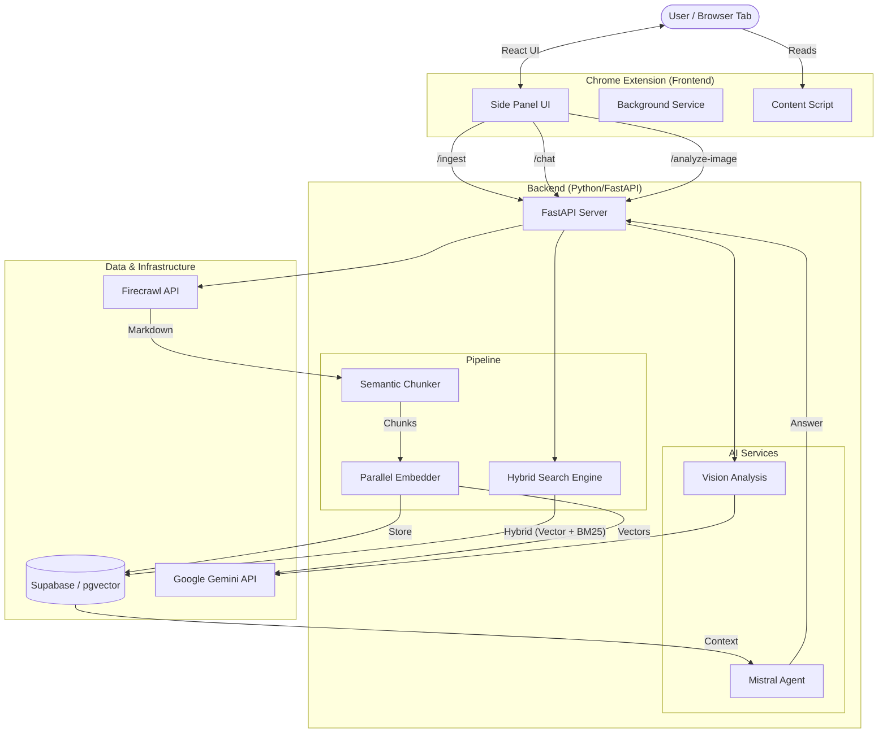

# SnapMind - Browser RAG Assistant

**SnapMind** is a production-grade RAG (Retrieval-Augmented Generation) system designed to run as a browser extension. It turns your browser into a context-aware AI assistant that remembers what you've read, allowing you to chat with webpages, documentation, and images using advanced LLMs and hybrid search technology.

## 🏗️ Architecture Overview

The system follows a modern microservices architecture optimized for latency and retrieval accuracy.



---

## 🚀 Core Features & Technical Implementation

### 1. Advanced Ingestion Pipeline
The ingestion system (`backend/rag_pipeline.py`) is robust and handles complex web content.
*   **Crawler**: Uses **Firecrawl** to convert webpages into clean Markdown, stripping noise (headers, footers).
*   **Semantic Chunking** (`backend/chunking.py`): 
    *   Preserves **Code Blocks** (`` ``` ``) and **Tables** intact.
    *   Splits by **Markdown Headers** (#, ##, ###) to maintain logical sections.
    *   Uses intelligent overlap (20%) to prevent context loss at boundaries.
*   **Parallel Embedding**: Uses `concurrent.futures` to embed chunks in parallel using **Google Gemini 2.0 Flash**, significantly reducing ingestion time.

### 2. Hybrid Search Engine (Vector + Keyword)
Retrieval is handled by a custom PostgreSQL function (`backend/database_migration_phase2.sql`).
*   **Vector Search**: Uses `pgvector` with Cosine Similarity to find semantic matches.
*   **Keyword Search**: Uses PostgreSQL's `tsvector` and `ts_rank` (BM25 algorithm) for exact localized matches.
*   **RRF Fusion**: Combines scores using Reciprocal Rank Fusion:
    $$ Score = (Vector \times 0.7) + (Keyword \times 0.3) $$

### 3. Vision & Multimodal Analysis
*   **Gemini Vision Integration**: analyzed images are processed server-side (`backend/vision.py`).
*   **Modes**:
    *   `qa`: General Question Answering about the image.
    *   `extraction`: OCR and structured data extraction from screenshots.

### 4. Streaming Responses
*   Uses **server-sent events (NDJSON)** to stream LLM tokens to the frontend in real-time, providing a snappy user experience.

---

## 🔌 API Reference (Backend)

The backend runs on `http://127.0.0.1:8000`.

### `POST /ingest`
Ingests a webpage into the knowledge base.
```json
{
  "url": "https://example.com/docs",
  "crawl_mode": "single", // "single" or "multi"
  "max_pages": 10
}
```

### `POST /chat`
 Standard RAG chat endpoint.
```json
{
  "query": "How do I install this?",
  "site_id": "https://example.com/docs", // Optional filter
  "history": [{"role": "user", "content": "..."}]
}
```

### `POST /analyze-image`
Analyzes a base64 encoded image.
```json
{
  "image_data": "data:image/jpeg;base64,...",
  "prompt": "Explain this diagram",
  "mode": "qa" 
}
```

---

## 🛠️ Data Model (Supabase)

### `documents` Table
| Column | Type | Description |
| :--- | :--- | :--- |
| `id` | `bigint` | Primary Key |
| `content` | `text` | The text chunk content |
| `source_url` | `text` | Origin URL for filtering |
| `embedding` | `vector(768)` | Gemini 004 vector embedding |
| `metadata` | `jsonb` | Stores headers, chunk index, etc. |
| `created_at` | `timestamp` | Ingestion time |

---

## ⚙️ Configuration Guide

Configuration is centralized in `backend/.env` and `config.py`.

### Key Environment Variables

| Variable | Description | Default |
| :--- | :--- | :--- |
| `SUPABASE_URL` | Supabase Project URL | - |
| `SUPABASE_KEY` | Supabase `service_role` key | - |
| `GOOGLE_API_KEY` | Gemini API Key for Embeddings | - |
| `MISTRAL_API_KEY` | Mistral API Key for Chat | - |
| `FIRECRAWL_API_KEY` | Firecrawl API for scraping | - |

### Feature Flags (`backend/config.py`)

| Feature | Flag | Status |
| :--- | :--- | :--- |
| **Semantic Chunking** | `SEMANTIC_CHUNKING_ENABLED` | ✅ Active (Phase 1) |
| **Hybrid Search** | `SEARCH_MODE="hybrid"` | ✅ Active (Phase 2) |
| **Reranking** | `RERANK_ENABLED` | 🚧 Planned (Phase 3) |
| **Semantic Caching** | `CACHE_ENABLED` | 🚧 Planned (Phase 6) |

---

## � Detailed Setup Instructions

### 1. Clone & Prerequisites
Ensure you have **Python 3.10+** and **Node.js 18+**.

### 2. Backend Setup
1.  Navigate to `backend/`.
2.  Create virtual env: `python -m venv venv`.
3.  Activate: `venv\Scripts\activate` (Win) or `source venv/bin/activate` (Mac/Linux).
4.  Install deps: `pip install -r requirements.txt`.
5.  **Secrets**: Copy `.env.example` to `.env` and fill in your keys.
6.  Run: `uvicorn main:app --reload`.

### 3. Extension Setup
1.  Navigate to `extension/`.
2.  Install deps: `npm install`.
3.  **Secrets**: Copy `.env.example` to `.env`. Set `VITE_BACKEND_URL=http://127.0.0.1:8000`.
4.  Build: `npm run build`.
5.  Load `extension/dist` key in Chrome (`chrome://extensions/` -> Load Unpacked).

---

## 🤝 Contributing
Contributions are welcome!
1.  Fork the repo.
2.  Create a branch for your feature.
3.  Submit a Pull Request.

## 📄 License
This project is for educational purposes.
